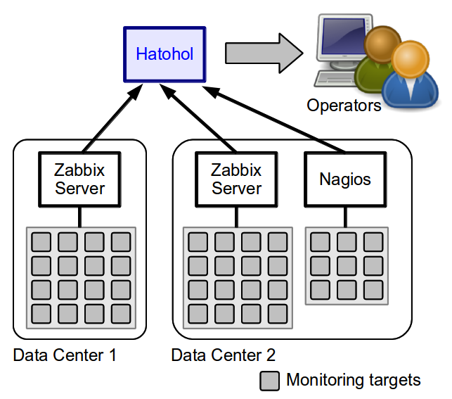
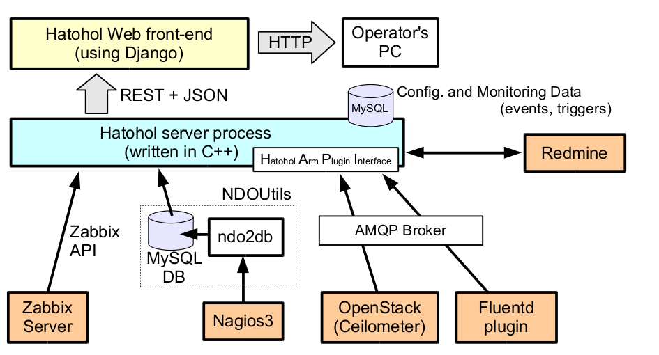
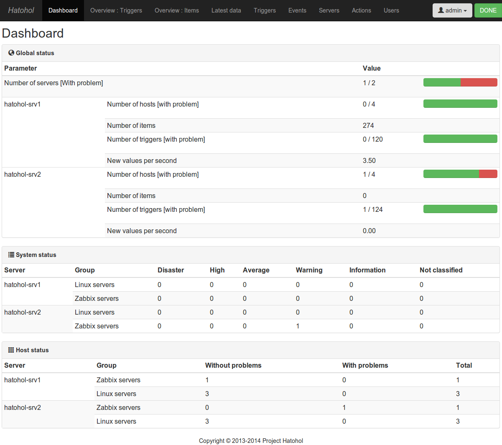
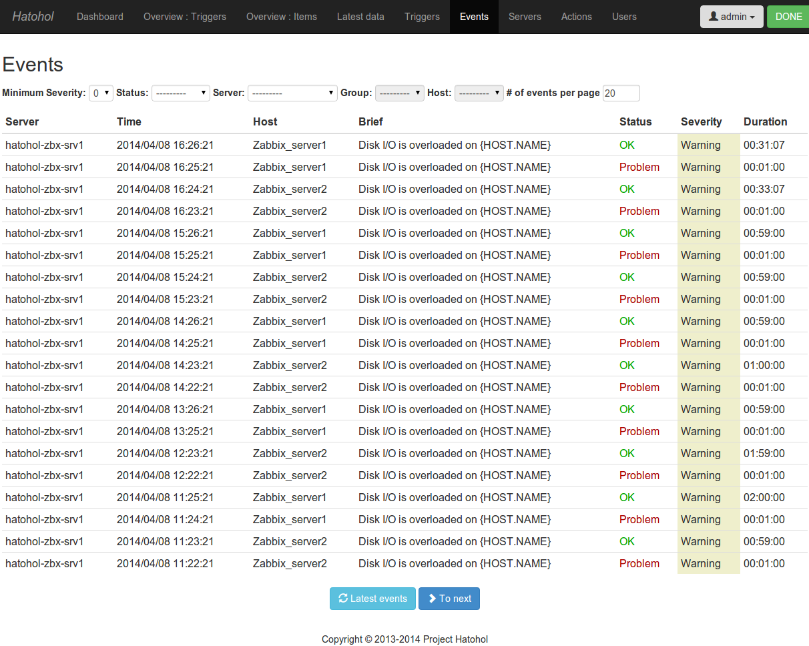
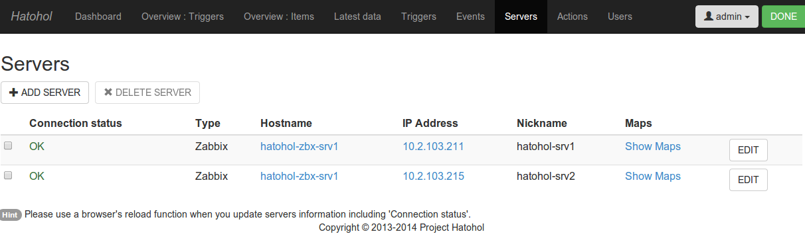

# Hatohol

日本語のHatoholウェブサイトを開設しました。以下のホームページをご覧ください。
http://www.hatohol.org/

## Table of Contents
- [Overview](#user-content-overview)
- [Project Hatohol](#user-content-project-hatohol)
- [Supported monitoring software](#user-content-supported-monitoring-software)
- [Supported incident tacking software](#user-content-supported-incident-tracking-software)
- [Supported platforms](#user-content-supported-platforms)
- [Basic architecture](#user-content-basic-architecture)
- [Screenshots](#user-content-screenshots)
- [Installation](#user-content-installation)
	- [Installation by RPM files (only for CentOS 7)](#user-content-installation-by-rpm-files-only-for-centos-7)
	- [Installation by building needed applications](#user-content-installation-by-building-needed-applications)
	- [About Upgrade on CentOS 7 (x86_64) from version 16.12_to version 17.06](#user-content-about-upgrade-on-centos-7-x86_64-from-version-1612-to-version-1706)
- [Plans](#user-content-plans)
- [Mailing Lists](#user-content-mailing-lists)

## Overview
Hatohol consolidates monitoring data from any number of running monitoring systems on one screen. This feature enables
the integration of monitoring centers, even when these centers are in different places or are being monitored by 
different software.

Hatohol currently maintains the following information:

- Items

  Monitoring items of targets, such as CPU load and free memory size.

- Triggers

  The current status of monitoring items.

- Events

  History of items' status changes. When an event detected, Hatohol can execute a defined user command (called an action).

## Project Hatohol
Hatohol is an open source software developed and copyrighted by Project Hatohol.
We welcome participation in all stages of our development (bug fixes, bug reports, feature requests/suggestions/discussion, functional improvement, etc.) 

## Supported monitoring software
- Zabbix 2.0
- Zabbix 2.2
- Zabbix 2.4
- Zabbix 3.0
- Nagios3 (with NDOUtils)
- Nagios4 (with NDOUtils)
- Ceilometer (OpenStack)
- Fluentd

## Supported incident tracking software
- Redmine

## Supported platforms
- CentOS 7 (x86\_64)
- Ubuntu Server 12.04.5 LTS (64-bit)
- Ubuntu 14.04 LTS (64-bit)

## Basic architecture
Hatohol consists of a server and a Web front-end.
Hatohol server gathers monitoring information from monitoring servers such
as Zabbix, Nagios, Ceilometer, and Fluentd. It then integrates gathered data
and stores in the DB.
The other programs can get the integrated data via Hatohol's REST API.
A Hatohol Web front-end internally communicates with
the server and creates a response page to see the consolidated data.

The architecture used, makes it easy to develop alternative clients. There is no internal complication in adding Android applications, iOS applications, Win32 native clients or Web applications with other frameworks.

## Screenshots
- Dashboard

- Events

- Servers

Other pages are being constructed.

## Installation
### Installation by RPM files (only for CentOS 7)
The detailed document is [here](https://github.com/project-hatohol/website/blob/master/contents/docs/install/17.06/en/index.md)

### Installation by building needed applications
- [Server installation](server/README.md)
- [Client (Web UI server) installation](client/README.md)

### About Upgrade on CentOS 7 (x86_64) from version 16.12 to version 17.06
We are currently under investigation.

## Plans
See [Milestone](https://github.com/project-hatohol/hatohol/milestones)

We will continue to add, what we believe are, useful features. If you have requests or good ideas, do not hesitate to discuss them with us!

## Mailing Lists
Below are the mailing lists to discuss Hatohol:

* hatohol-users@lists.osdn.me
  * Discuss anything related to installing and using Hatohol (for Japanese users).
  * How to subscribe: http://lists.osdn.me/mailman/listinfo/hatohol-users
* hatohol-users@lists.sourceforge.net
  * Discuss anything related to installing and using Hatohol (for English speaking users).
  * How to subscribe: https://lists.sourceforge.net/lists/listinfo/hatohol-users
* hatohol-commit@lists.sourceforge.net
  * Receive commit notifications & be able to discuss each commit.
  * How to subscribe: https://lists.sourceforge.net/lists/listinfo/hatohol-commit
* For Hatohol developers
  * There is currently no mailing list to discuss Hatohol development.
  * Please use github issue instead: https://github.com/project-hatohol/hatohol/issues
