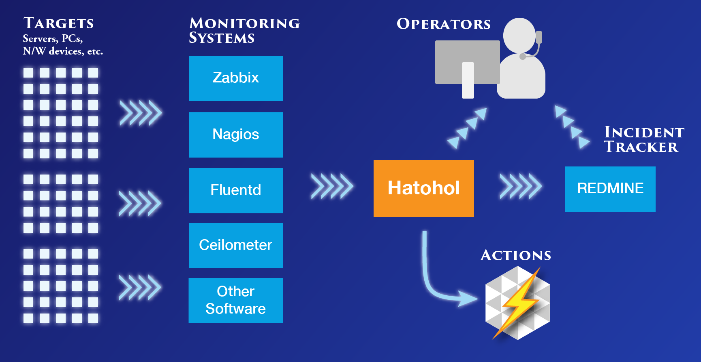

Hatohol
=======

日本語のHatoholウェブサイトを開設しました。以下のホームページをご覧ください。
http://www.hatohol.org/

Overview
--------
Hatohol consolidates monitoring data from any number of running monitoring systems on one screen. This feature enables
the integration of monitoring centers, even when these centers are in different places or are being monitored by 
different software.

Hatohol currently maintains the following information:

- Items

  Monitoring items of targets, such as CPU load and free memory size.

- Triggers

  The current status of monitoring items.

- Events

  History of items' status changes. When an event detected, Hatohol can execute a defined user command (called an action).

Project Hatohol
-----------------------------
Hatohol is an open source software developed and copyrighted by Project Hatohol.
We welcome participation in all stages of our development (bug fixes, bug reports, feature requests/suggestions/discussion, functional improvement, etc.) 

Supported monitoring software
-----------------------------
- ZABBIX 2.0
- Nagios3 (with NDOUtils)

Supported platforms
-----------------------------
- CentOS 6.5 (x86\_64)
- Ubuntu Server 12.04.2 LTS (64-bit)
- Ubuntu 13.04 (64-bit) [supported until the next Ubuntu release]

Basic architecture
------------------
Hatohol consists of a server and a client using Web UI. Hatohol server gathers monitoring information and consolidates it. The integration of data is done via JSON format using HTTP (REST). A Hatohol client internally communicates with
the server and creates a response page to see the consolidated data.

The architecture used, makes it easy to develop alternative clients. There is no internal complication in adding Android applications, iOS applications, Win32 native clients or Web applications with other frameworks.

Screenshots
-----------
- Dashboard

- Events

- Servers

Other pages are being constructed.

Installation
------------
### Installation by RPM files (only for CentOS 6.5)
The detailed document is [here](https://github.com/project-hatohol/website/blob/master/contents/docs/install/14.06/ja/index.md)

### Installation by building needed applications
- [Server installation](server/README.md)
- [Client (Web UI server) installation](client/README.md)

### Upgrade by RPM files from ver.0.1 to ver.13.12(only for CentOS 6.4)
The detailed document is [here](doc/upgrade/hatohol13.12-from0.1-centos6.4.md)

Plans
-----
See [Milestone](https://github.com/project-hatohol/hatohol/issues/milestones)

We will continue to add, what we believe are, useful features. If you have requests or good ideas, do not hesitate to discuss them with us!

Mailing Lists
-------------
Below are the mailing lists to discuss Hatohol:

* hatohol-users@lists.sourceforge.jp
  * Discuss anything related to installing and using Hatohol (for Japanese users).
  * How to subscribe: http://lists.sourceforge.jp/mailman/listinfo/hatohol-users
* hatohol-users@lists.sourceforge.net
  * Discuss anything related to installing and using Hatohol (for English speaking users).
  * How to subscribe: https://lists.sourceforge.net/lists/listinfo/hatohol-users
* hatohol-commit@lists.sourceforge.net
  * Receive commit notifications & be able to discuss each commit.
  * How to subscribe: https://lists.sourceforge.net/lists/listinfo/hatohol-commit
* For Hatohol developers
  * There is currently no mailing list to discuss Hatohol development.
  * Please use github issue instead: https://github.com/project-hatohol/hatohol/issues
